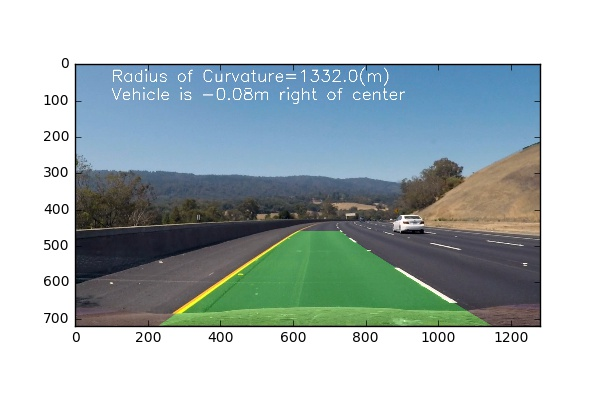

# Advanced Lane Lines Detection
This Project is the fourth task of the Udacity Self-Driving Car Nanodegree program. The main goal of the project is to write a  software pipeline to identify the lane boundaries in a video from a front-facing camera on a car.

## Contents of this repository

- `AdvancedFindLaneLines.ipynb` Jupyter notebook with code for the project
- `output_images` a directory with processed images
- `output_videos` a directory with processed videos
- `test_images` a directory with test images
- `camera_calib` a directory with camera calibration images


## Contensts of the program

The goals / steps of this project are the following:

* Compute the camera calibration matrix and distortion coefficients given a set of chessboard images.
* Apply a distortion correction to raw images.
* Use color transforms, gradients, etc., to create a thresholded binary image.
* Apply a perspective transform to rectify binary image ("birds-eye view").
* Detect lane pixels and fit to find the lane boundary.
* Determine the curvature of the lane and vehicle position with respect to center.
* Warp the detected lane boundaries back onto the original image.
* Output visual display of the lane boundaries and numerical estimation of lane curvature and vehicle position.


## Compute the camera calibration matrix and distortion coefficients given a set of chessboard images.

### Measuring Distortion

OpenCV functions `findChessboardCorners()` and `drawChessboardCorners()` were used to automatically find and draw corners in the given images of chessboard pattern. It is expected to detect 9x6 grid of corners on the calibrated images.

Applying these two functions to a sample image, you'll get a result like this::


### Image undistortion
Opencv function `cv2.undistort()` function was used to undistor t original images according to the  previously computed camera matrix and distortion coefficients. Results are shown below:


## Use color transforms, gradients, etc., to create a thresholded binary image.

### Binary images

In this code cell,several useful functions were defined to *create thresholded bianry image*.The functions are listed below:
red_thresh(),abs _sobel _thresh(),mag_thresh(),dir_thresh(),
pipeline().

The former four functions are thresholded functions means red_channel,absolute_sobel,magnitude,direction respectively. 

`pipeline()` is used to combine the thresholded image results to create the final binary image.Finally, I found out red channel plus saturation channel in HLS color space plus grad_thresh were the best performance.However,there are many 
different combined ways to get the best results. An example of image, used for line detection, is given below.

###Changes in the combined binary image(after review)
In the `pipeline()`function,I changed my combination method to overcome the challenge of shadow and strong
shift of lightning.Here is the new former:

```
combined_binary[((s_binary==1)|(gradx==1))&(gray_binary==1)|(red_binary==1)]=1
```

I finetuned the hyper paramters in the thresholed function.The results shows better than before.And here I'll give my sincere thanks to the reviewer for the helpful suggestion.  


### Apply a perspective transform to rectify binary image ("birds-eye view").

The code for my perpsective transform is includes a function `warper()`, The `warper()` function takes as inputs an image,as
return warper_binary,tranform Matrix `M` and the inverse Matrix `Minv`.The source points and the destination points were hardcoded in the following manner: 

```Python
src = np.float32(
	[[(img_size[0] / 2) - 55, img_size[1] / 2 + 100],
	[((img_size[0] / 6) - 10), img_size[1]],
	[(img_size[0] * 5 / 6) + 60, img_size[1]],
	[(img_size[0] / 2 + 55), img_size[1] / 2 + 100]])
dst = np.float32(
	[[(img_size[0] / 4), 0],
	[(img_size[0] / 4), img_size[1]],
	[(img_size[0] * 3 / 4), img_size[1]],
	[(img_size[0] * 3 / 4), 0]])
```

This resulted in the following source and destination points:

| Source        | Destination   | 
|:-------------:|:-------------:| 
| 585, 460      | 320, 0        | 
| 203, 720      | 320, 720      |
| 1127, 720     | 960, 720      |
| 695, 460      | 960, 0        |

Sample images after undistortion and warping are presented below.


Those warped images are used for the following analysis. 

## Detect lane pixels and fit to find the lane boundary.

The above binary results were feeded in the `find_lane` function in this section. It is used to detect lanelines in the image as well as video streams,which depend on the histogram method.The results are below.


## Determine the curvature of the lane and vehicle position with respect to center.

Two functions were created in this section.`calc_r_curv` was used to calculate the radius of curvature while `calc_pos` was
to calculate the offset between the center of two laneline and 
the center of the vehicle(image).The conversions in x and y from pixels space to meters were defined as below.
```python
ym_per_pix = 30/720 # meters per pixel in y dimension
xm_per_pix = 3.7/700 # meters per pixel in x dimension
```

## Warp the detected lane boundaries back onto the original image.
 
In this section,`draw_lanlines` was defined to draw the lane
boundaries found with the help of above functions.Here is the
sample image.


## Output visual display of the lane boundaries and numerical estimation of lane curvature and vehicle position.

Finally,video were processed in this section.`process` function
was defined for each frame grabbed from the video stream. The 
resulting videos are in the `output_videos/` directory.

## Results and discussion

   Results show out that the algorithm fails in difficult 
situations like poor light or shining light conditions.The lane lines can disappear in the difficult light conditions.So my alogorithm only can solve the straight lines and fails in the harder_challenge videos.


## Improvement ideas
- The combined_thresholded algorithm can be improved in order to make it more robust,because the binary image is important 
for further boundary detection.
 
